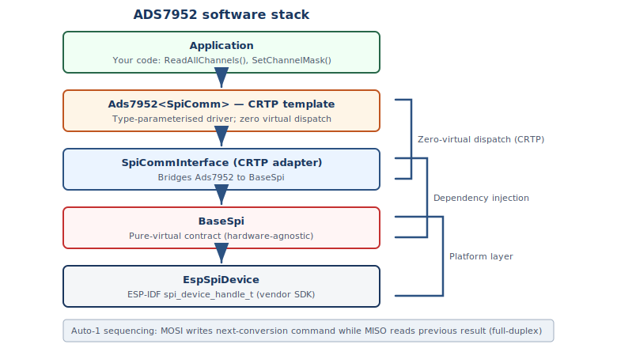

# 🔧 Platform Integration

The HF-ADS7952 driver uses the **Curiously Recurring Template Pattern (CRTP)** to provide a zero-overhead hardware abstraction for the SPI bus. This guide shows how to implement the SPI interface for your platform.

---

## Architecture



```
┌──────────────────────────────────────┐
│  ADS7952<SpiType>                    │   ← Driver (platform-agnostic)
│  - ReadChannel()                     │
│  - ReadAllChannels()                 │
│  - ProgramAlarm() / ProgramGPIO()    │
│  - spiTransfer16()                   │
└──────────────┬───────────────────────┘
               │ calls transfer()
┌──────────────▼───────────────────────┐
│  SpiInterface<Derived>               │   ← CRTP Base (ads7952_spi_interface.hpp)
│  - transfer(tx, rx, len)             │
└──────────────┬───────────────────────┘
               │ static dispatch (compile-time)
┌──────────────▼───────────────────────┐
│  YourPlatformSpi                     │   ← Your Implementation
│  - transfer(tx, rx, len)             │
└──────────────────────────────────────┘
```

The CRTP pattern provides **compile-time polymorphism** — no virtual function overhead, no vtable, and the compiler can fully inline the SPI calls into the driver methods.

---

## Required Interface

You must implement a class that:

1. Inherits from `ads7952::SpiInterface<YourClass>`
2. Declares `ads7952::SpiInterface<YourClass>` as a `friend`
3. Provides a `protected` `transfer()` method

### Method Signature

```cpp
void transfer(const uint8_t* tx_data, uint8_t* rx_data, size_t length);
```

| Parameter | Description |
|-----------|-------------|
| `tx_data` | Pointer to transmit buffer (bytes to send) |
| `rx_data` | Pointer to receive buffer (bytes read back) |
| `length` | Number of bytes to transfer (always 2 for ADS7952) |

### SPI Transfer Contract

- The driver calls `transfer()` with exactly **2 bytes** per call (one 16-bit SPI frame)
- The transfer must be **full-duplex** — simultaneously sending `tx_data` and receiving into `rx_data`
- **MSB first** byte ordering — `tx_data[0]` is the high byte (DI[15:8]), `tx_data[1]` is the low byte (DI[7:0])
- Your implementation must manage **CS̄ framing** — assert CS̄ low before the transfer and deassert after. Most SPI peripheral drivers handle this automatically.

---

## ESP32 Implementation (ESP-IDF)

The ESP-IDF `spi_master` driver handles CS toggling automatically:

```cpp
#pragma once

#include "ads7952_spi_interface.hpp"
#include "driver/spi_master.h"

class Esp32Ads7952Spi : public ads7952::SpiInterface<Esp32Ads7952Spi> {
    friend class ads7952::SpiInterface<Esp32Ads7952Spi>;

public:
    explicit Esp32Ads7952Spi(spi_device_handle_t device)
        : device_(device) {}

protected:
    void transfer(const uint8_t* tx_data, uint8_t* rx_data, size_t length) {
        spi_transaction_t t = {};
        t.length    = length * 8;  // ESP-IDF uses bit length
        t.tx_buffer = tx_data;
        t.rx_buffer = rx_data;
        spi_device_polling_transmit(device_, &t);
    }

private:
    spi_device_handle_t device_;
};
```

### ESP32 SPI Bus Setup

```cpp
// Configure SPI bus
spi_bus_config_t bus_cfg = {};
bus_cfg.mosi_io_num = GPIO_NUM_11;
bus_cfg.miso_io_num = GPIO_NUM_13;
bus_cfg.sclk_io_num = GPIO_NUM_12;
bus_cfg.quadwp_io_num = -1;
bus_cfg.quadhd_io_num = -1;
bus_cfg.max_transfer_sz = 2;

spi_bus_initialize(SPI2_HOST, &bus_cfg, SPI_DMA_DISABLED);

// Add device
spi_device_interface_config_t dev_cfg = {};
dev_cfg.mode = 0;                          // SPI Mode 0 (CPOL=0, CPHA=0)
dev_cfg.clock_speed_hz = 10 * 1000 * 1000; // 10 MHz
dev_cfg.spics_io_num = GPIO_NUM_10;        // CS pin
dev_cfg.queue_size = 1;

spi_device_handle_t handle;
spi_bus_add_device(SPI2_HOST, &dev_cfg, &handle);

// Create driver
Esp32Ads7952Spi spi(handle);
ads7952::ADS7952<Esp32Ads7952Spi> adc(spi, 2.5f, 5.0f);
adc.EnsureInitialized();
```

---

## STM32 Implementation (HAL)

```cpp
#pragma once

#include "ads7952_spi_interface.hpp"
#include "stm32f4xx_hal.h"

class Stm32Ads7952Spi : public ads7952::SpiInterface<Stm32Ads7952Spi> {
    friend class ads7952::SpiInterface<Stm32Ads7952Spi>;

public:
    Stm32Ads7952Spi(SPI_HandleTypeDef* hspi, GPIO_TypeDef* cs_port, uint16_t cs_pin)
        : hspi_(hspi), cs_port_(cs_port), cs_pin_(cs_pin) {}

protected:
    void transfer(const uint8_t* tx_data, uint8_t* rx_data, size_t length) {
        HAL_GPIO_WritePin(cs_port_, cs_pin_, GPIO_PIN_RESET);  // CS low
        HAL_SPI_TransmitReceive(hspi_,
            const_cast<uint8_t*>(tx_data), rx_data, length, HAL_MAX_DELAY);
        HAL_GPIO_WritePin(cs_port_, cs_pin_, GPIO_PIN_SET);    // CS high
    }

private:
    SPI_HandleTypeDef* hspi_;
    GPIO_TypeDef* cs_port_;
    uint16_t cs_pin_;
};
```

---

## Generic Linux Implementation (spidev)

```cpp
#pragma once

#include "ads7952_spi_interface.hpp"
#include <linux/spi/spidev.h>
#include <sys/ioctl.h>

class LinuxSpi : public ads7952::SpiInterface<LinuxSpi> {
    friend class ads7952::SpiInterface<LinuxSpi>;

public:
    explicit LinuxSpi(int fd) : fd_(fd) {}

protected:
    void transfer(const uint8_t* tx_data, uint8_t* rx_data, size_t length) {
        struct spi_ioc_transfer tr = {};
        tr.tx_buf = reinterpret_cast<unsigned long>(tx_data);
        tr.rx_buf = reinterpret_cast<unsigned long>(rx_data);
        tr.len    = length;
        ioctl(fd_, SPI_IOC_MESSAGE(1), &tr);
    }

private:
    int fd_;
};
```

---

## Arduino Implementation

```cpp
#pragma once

#include "ads7952_spi_interface.hpp"
#include <SPI.h>

class ArduinoAds7952Spi : public ads7952::SpiInterface<ArduinoAds7952Spi> {
    friend class ads7952::SpiInterface<ArduinoAds7952Spi>;

public:
    explicit ArduinoAds7952Spi(uint8_t cs_pin) : cs_pin_(cs_pin) {
        pinMode(cs_pin_, OUTPUT);
        digitalWrite(cs_pin_, HIGH);
    }

protected:
    void transfer(const uint8_t* tx_data, uint8_t* rx_data, size_t length) {
        SPI.beginTransaction(SPISettings(10000000, MSBFIRST, SPI_MODE0));
        digitalWrite(cs_pin_, LOW);
        for (size_t i = 0; i < length; i++) {
            rx_data[i] = SPI.transfer(tx_data[i]);
        }
        digitalWrite(cs_pin_, HIGH);
        SPI.endTransaction();
    }

private:
    uint8_t cs_pin_;
};
```

---

## Key Rules

| Rule | Details |
|------|---------|
| **CS̄ management** | Your implementation must handle chip select. The driver does not toggle CS̄. |
| **16-bit frames** | The driver always calls `transfer()` with `length = 2`. It handles byte↔word conversion internally via `spiTransfer16()`. |
| **MSB first** | Byte 0 = high byte (DI[15:8]), Byte 1 = low byte (DI[7:0]). |
| **Full duplex** | Every transfer simultaneously sends commands and receives conversion data. |
| **SPI Mode 0** | CPOL = 0, CPHA = 0 — data sampled on rising SCLK edge. |

---

## Testing Your Implementation

After implementing the SPI interface, a quick validation:

```cpp
MyPlatformSpi spi(/* config */);
ads7952::ADS7952<MyPlatformSpi> adc(spi, 2.5f, 5.0f);

if (!adc.EnsureInitialized()) {
    printf("ERROR: Initialization failed — check SPI wiring\n");
    return;
}

// ReadChannel should return a valid result
auto result = adc.ReadChannel(0);
if (result.ok()) {
    printf("CH0: %u counts (%.3f V) — SPI working!\n", result.count, result.voltage);
} else {
    printf("ERROR: ReadChannel failed with error %u\n",
           static_cast<unsigned>(result.error));
}
```

**Checklist:**
- [ ] `result.ok()` returns `true`
- [ ] `result.count` is between 0 and 4095
- [ ] `result.channel` matches the requested channel
- [ ] `result.voltage` is a reasonable value for your input signal

---

**Navigation**
⬅️ [Hardware Setup](hardware_setup.md)  ➡️ [Configuration](configuration.md)
